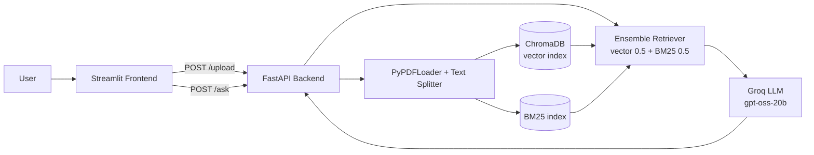

# DocMind: PDF Question Answering with Hybrid RAG

Upload any PDF and ask questions about it in plain English. DocMind retrieves the most relevant passages using **hybrid search (BM25 keyword search + vector embeddings)** and generates answers grounded only in your document.

**Live demo:** https://respectful-nourishment-production-bb60.up.railway.app/

**API docs:** https://docmind-rag-production-d5e8.up.railway.app/docs

<!-- Add a screenshot or GIF here -->


<!--  -->

---

## Features

- Upload a PDF and chat with it through a simple Streamlit interface
- **Hybrid retrieval:** combines semantic (vector) search and keyword (BM25) search with a 50/50 ensemble, so it handles both paraphrased and exact-term questions
- **Grounded answers:** the prompt restricts the LLM to the retrieved context and returns "I don't know based on the provided document." when the answer isn't there
- **Decoupled architecture:** FastAPI backend and Streamlit frontend deployed as separate services on Railway
- Basic error handling and timeouts on the frontend

## Architecture



**Ingestion (`/upload`):**
1. The PDF is loaded with `PyPDFLoader` and pages are merged into one text.
2. `RecursiveCharacterTextSplitter` splits it into chunks (1000 characters, 200 overlap).
3. Chunks are embedded with `BAAI/bge-small-en-v1.5` and stored in ChromaDB.
4. The same chunks are indexed with BM25.

**Question answering (`/ask`):**
1. The question is sent to both retrievers (top 8 from each).
2. Results are merged by the `EnsembleRetriever`.
3. The merged context and the question go into a prompt that forces context-only answers.
4. The Groq-hosted LLM generates the final answer.

## Tech Stack

| Layer | Tools |
|---|---|
| Frontend | Streamlit |
| Backend | FastAPI, Uvicorn |
| Orchestration | LangChain |
| Vector store | ChromaDB |
| Keyword search | BM25 (`rank-bm25`) |
| Embeddings | `BAAI/bge-small-en-v1.5` (Hugging Face) |
| LLM | `openai/gpt-oss-20b` via Groq |
| Deployment | Railway |

## Run Locally

```bash
git clone https://github.com/hamza-amjad10/DocMind-RAG.git
cd DocMind-RAG

python -m venv venv
source venv/bin/activate        # Windows: venv\Scripts\activate
pip install -r requirements.txt
```

Create a `.env` file:

```
GROQ_API_KEY=your_groq_key
HUGGINGFACEHUB_API_TOKEN=your_hf_token
```

Start the backend:

```bash
uvicorn main:app --reload --port 8000
```

In a second terminal, start the frontend (set `BACKEND_URL` in the frontend file to `http://127.0.0.1:8000`):

```bash
streamlit run frontend.py
```

## API

| Method | Endpoint | Description |
|---|---|---|
| POST | `/upload` | Upload a PDF (multipart form, field `file`) and build the indexes |
| POST | `/ask` | Body: `{"question": "..."}`, returns `{"answer": "..."}` |

## Known Limitations

- **Single shared index:** one document is active at a time, so a new upload replaces the previous one for all users. Per-session indexes are the planned fix.
- **Ephemeral storage:** indexes are stored on the container's disk and are lost on restart or redeploy, so the PDF needs to be re-uploaded afterwards.
- **Text-only PDFs:** scanned PDFs (images) are not supported because there is no OCR step.

## Roadmap

- [ ] Per-session document indexes (multi-user support)
- [ ] Show source chunks / page numbers with each answer
- [ ] Support multiple documents
- [ ] OCR for scanned PDFs
- [ ] Retrieval evaluation (accuracy on a labelled question set)

## Author

**Hamza Amjad**
GitHub: [@hamza-amjad10](https://github.com/hamza-amjad10)
