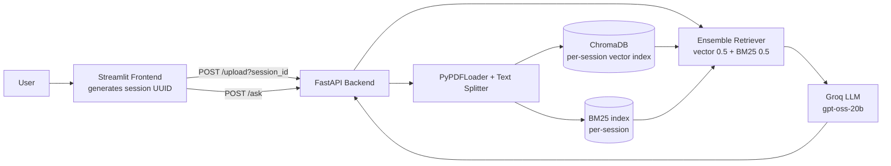

# DocMind: PDF Question Answering with Hybrid RAG

Upload any PDF and ask questions about it in plain English. DocMind retrieves the most relevant passages using hybrid search (BM25 keyword search + vector embeddings) and generates answers grounded only in your document, with page-number citations.

**Live demo:** https://respectful-nourishment-production-bb60.up.railway.app/

**API docs:** https://docmind-rag-production-d5e8.up.railway.app/docs

**1. Upload a PDF**


**2. Ask a question**


---

## Features

- Upload a PDF and chat with it through a simple Streamlit interface
- **Hybrid retrieval:** combines semantic (vector) search and keyword (BM25) search with a 50/50 ensemble, so it handles both paraphrased and exact-term questions
- **Grounded answers:** the prompt restricts the LLM to the retrieved context and returns "I don't know based on the provided document." when the answer isn't there
- **Decoupled architecture:** FastAPI backend and Streamlit frontend deployed as separate services on Railway
- **Per-session isolation:** every browser session generates its own UUID, with a separate vector index, BM25 index, and upload folder, so users never see or overwrite each other's documents
- **Source citations:** each answer shows the page numbers it was drawn from (e.g. "Sources: Page 3, Page 5")
- **Basic API hardening:** UUID validation on session IDs, fixed server-side file names (no user-controlled paths), and PDF-only uploads

## Architecture



**Ingestion (`/upload`):**
1. The PDF is saved under the session's folder and loaded page by page with `PyPDFLoader`, preserving page numbers for citations.
2. Text is cleaned and `RecursiveCharacterTextSplitter` splits it into chunks (1000 characters, 200 overlap).
3. Chunks are embedded with `BAAI/bge-small-en-v1.5` and stored in a per-session ChromaDB collection.
4. The same chunks are indexed with BM25 and saved per session.

**Question answering (`/ask`):**
1. The question is sent to both retrievers (top 8 from each).
2. Results are merged by the `EnsembleRetriever`, and the top 5 chunks are used as context.
3. The context and the question go into a prompt that forces context-only answers.
4. The Groq-hosted LLM generates the final answer, returned along with the source page numbers.

## Tech Stack

| Layer | Tools |
|---|---|
| Frontend | Streamlit |
| Backend | FastAPI, Uvicorn |
| Orchestration | LangChain |
| Vector store | ChromaDB |
| Keyword search | BM25 (`rank-bm25`) |
| Embeddings | `BAAI/bge-small-en-v1.5` (Hugging Face) |
| LLM | `openai/gpt-oss-20b` via Groq |
| Deployment | Railway |

## Run Locally

```bash
git clone https://github.com/hamza-amjad10/DocMind-RAG.git

python -m venv venv
source venv/bin/activate        # Windows: venv\Scripts\activate
pip install -r requirements.txt
```

Create a `.env` file:

```
GROQ_API_KEY=your_groq_key
HUGGINGFACEHUB_API_TOKEN=your_hf_token
```

Start the backend:

```bash
uvicorn main:app --reload --port 8000
```

In a second terminal, start the frontend (set `BACKEND_URL` in the frontend file to `http://127.0.0.1:8000`):

```bash
streamlit run frontend.py
```

## API

| Method | Endpoint | Description |
|---|---|---|
| POST | `/upload?session_id=<uuid>` | Upload a PDF (multipart form, field `file`) and build the indexes for that session |
| POST | `/ask` | Body: `{"question": "...", "session_id": "<uuid>"}`. Returns `{"answer": "...", "sources": [page numbers]}` |

The session ID is generated by the Streamlit frontend (`uuid4`) and must be a valid UUID.

## Known Limitations

- **Ephemeral storage:** session indexes are stored on the container's disk and are lost on restart or redeploy, so the PDF needs to be re-uploaded afterwards.
- **No cleanup or authentication:** old session folders are not deleted automatically, and anyone with the link can upload or ask questions. This is a demo and not meant for sensitive documents.
- **Text-only PDFs:** scanned PDFs (images) are not supported because there is no OCR step.

## Author

**Hamza Amjad**
GitHub: [@hamza-amjad10](https://github.com/hamza-amjad10)
